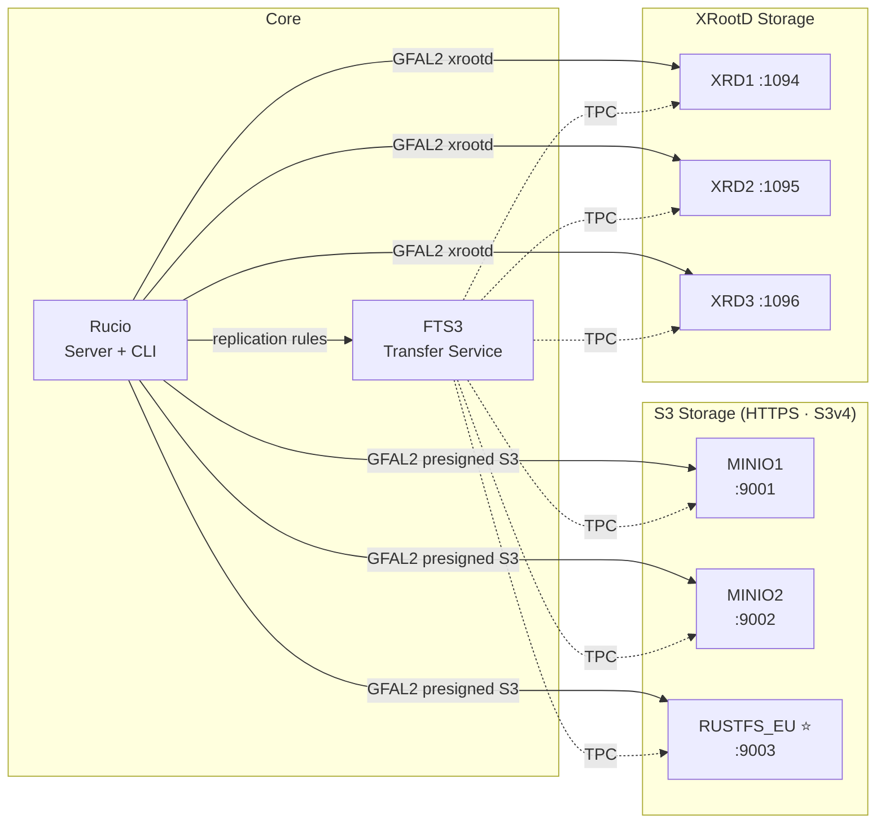

# Rucio - Scientific Data Management

Rucio is a software framework that provides functionality to organize, manage, and access large volumes of scientific data using customisable policies.
The data can be spread across globally distributed locations and across heterogeneous data centers, uniting different storage and network technologies as a single federated entity.
Rucio offers advanced features such as distributed data recovery or adaptive replication, and is highly scalable, modular, and extensible.
Rucio has been originally developed to meet the requirements of the high-energy physics experiment ATLAS, and is continuously extended to support LHC experiments and other diverse scientific communities.

## Documentation

General information, API/REST description and guides can be found in our [documentation](https://rucio.cern.ch/documentation) or on our [webpage](https://rucio.cern.ch).

## Try it out

We provide a [dockerized environment](https://github.com/rucio/rucio/tree/master/etc/docker/dev) which serves both as a demo environment and a development environment.
It includes all the necessary preconfigured components for multiple storage and transfers developments.

### Playground Architecture

> ⭐ **RUSTFS_EU** — Rust-based S3-compatible object store, added alongside MinIO to validate
> S3 protocol compatibility with Rucio. See [TUTORIAL-RUSTFS.md](TUTORIAL-RUSTFS.md) for the
> full integration guide.

## Developers

For information on how to contribute to Rucio, please refer and follow our [CONTRIBUTING](https://rucio.cern.ch/documentation/contributing) guidelines. We strongly recommend to use the [dockerized environment](https://github.com/rucio/rucio/tree/master/etc/docker/dev) for development.

## Operators

To learn how to deploy and configure Rucio, consult the [documentation](https://rucio.cern.ch/documentation) available online.

## Getting Support

If you are looking for support, please contact us via one of our [official channels](https://rucio.cern.ch/documentation/contact_us/).
