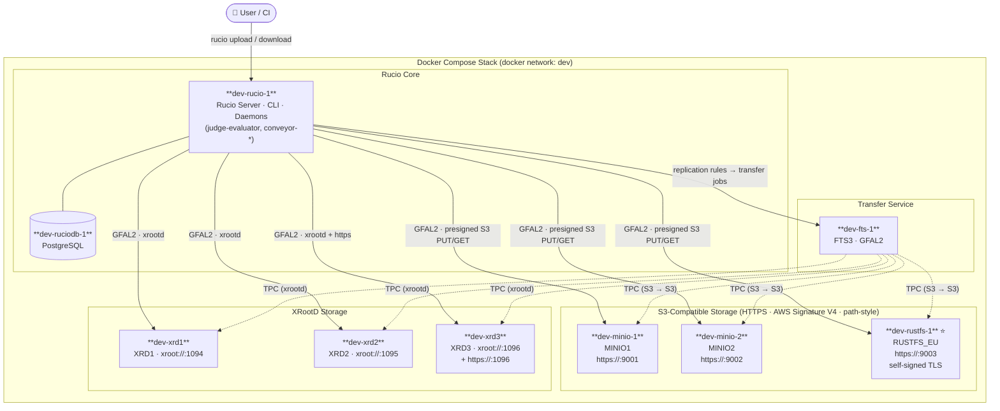
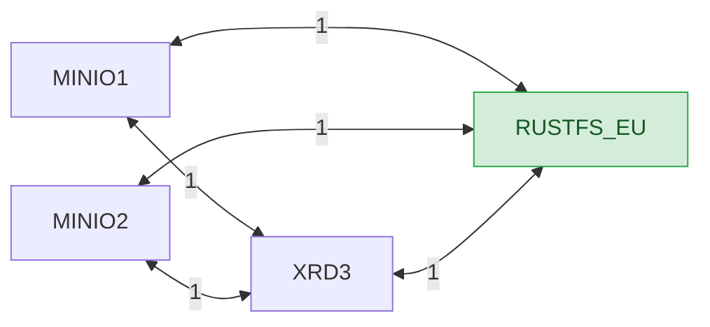

# RustFS + Rucio Integration Tutorial

This tutorial walks through adding a [RustFS](https://github.com/rustfs/rustfs) S3-compatible
storage node to the Rucio Docker Compose playground and verifying it with the same test suite
used for MinIO. By the end you will have:

- `RUSTFS_EU` registered as a Rucio RSE alongside `MINIO1`, `MINIO2`, and `XRD3`
- Successful direct upload, direct download, third-party copy (MINIO1 → RUSTFS_EU), and
  presigned-URL tests
- A printed compatibility matrix summarising pass/fail for each operation

---

## Architecture

### Container Layout



### RSE Transfer Topology (distances)

Rucio uses distances to select source RSEs for replication rules.
All links below are bidirectional with **distance = 1**.



> **⭐ RUSTFS_EU** is the new node added by this tutorial. All existing RSEs can act as source
> or destination for TPC transfers to/from it.

---

---

## Prerequisites

| Requirement | Notes |
|---|---|
| Docker ≥ 24 + Docker Compose v2 | `docker compose version` |
| `openssl` on the host | cert generation |
| This repository cloned locally | `git clone …` |

---

## Repository Layout (RustFS-relevant files)

```
qt-000-up.sh                          ← start the full stack (modified)
qt-010-rustfs-bucket.sh               ← create the rucio bucket in RustFS
qt-011-rustfs-rse.sh                  ← register RUSTFS_EU RSE in Rucio
qt-012-rustfs-fts-creds.sh            ← FTS3 + GFAL2 credentials for RustFS
qt-013-rustfs-tests.sh                ← upload / download / TPC / presigned-URL tests
qt-014-rustfs-results.sh              ← print compatibility matrix
qt-replay-rustfs.sh                   ← run qt-010 … qt-014 in one go

etc/certs/generate_rustfs.sh          ← generate self-signed TLS cert
etc/docker/dev/docker-compose-rustfs-override.yml  ← RustFS service definition
```

---

## Step 0 — Start the Stack

`qt-000-up.sh` generates TLS certificates for MinIO and RustFS, then brings up all services:

```bash
./qt-000-up.sh
```

Internally it runs:

```bash
etc/certs/generate_minio12.sh          # existing MinIO certs
etc/certs/generate_rustfs.sh           # NEW: self-signed cert for RustFS (CN=rustfs)

docker compose \
  --file etc/docker/dev/docker-compose-qt.yml \
  --file etc/docker/dev/docker-compose-rustfs-override.yml \
  --profile storage up -d
```

The RustFS service is defined in the override file. Key details:

```yaml
# etc/docker/dev/docker-compose-rustfs-override.yml
services:
  rustfs:
    image: rustfs/rustfs:latest
    container_name: dev-rustfs-1
    hostname: rustfs
    profiles: [storage]
    environment:
      RUSTFS_ACCESS_KEY: admin
      RUSTFS_SECRET_KEY: password
      RUSTFS_DOMAIN: ""          # force path-style URLs
    command: server --address :9003 --certs-dir /certs /data
    ports:
      - "9003:9003"
    volumes:
      - rustfs-data:/data
      - ../../certs/rustfs/public.crt:/certs/public.crt:ro
      - ../../certs/rustfs/private.key:/certs/private.key:ro
```

Wait for all containers to be healthy before proceeding:

```bash
docker ps --format "table {{.Names}}\t{{.Status}}"
```

---

## Step 1 — Initialise the Rucio Database

This is only needed the first time (or after `./qt-999-down.sh -v`):

```bash
./qt-001-initialize.sh
```

This runs `tools/run_tests.sh -ir` inside the Rucio container, which resets and re-seeds the
database, creates the `test` scope, and registers the XRootD RSEs (`XRD1`, `XRD2`, `XRD3`).

---

## Step 2 — Add HTTPS Protocol to XRD3

```bash
./qt-002-xrd3-http-protocol.sh
```

Registers an HTTPS protocol on XRD3 so it can participate in S3 third-party copies.

---

## Step 3 — Create MinIO Buckets

```bash
./qt-003-minio-buckets.sh
```

Uses `mc` (MinIO client) inside `dev-minio-1` / `dev-minio-2` to create the `rucio` bucket on
each instance. Note: MinIO listens on HTTPS ports `9001` / `9002`, so `MC_INSECURE=true` is
required for the self-signed certs.

---

## Step 4 — Register MinIO RSEs

```bash
./qt-004-minio-rses.sh
```

Registers `MINIO1` and `MINIO2` in Rucio with:

- `--scheme https` — **required** for GFAL2's S3 presigned-URL code path (see [Key Insight](#key-insight))
- `--impl rucio.rse.protocols.gfal.NoRename` — S3 has no server-side rename
- `sign_url=s3` attribute — tells Rucio to generate AWS Signature V4 presigned URLs
- `s3_url_style=path` — path-style (`host/bucket/key`) rather than virtual-hosted

Also writes `/opt/rucio/etc/rse-accounts.cfg` with the S3 access/secret keys and
`signature_version: s3v4`.

---

## Step 5 — Register MinIO Credentials in FTS3 + GFAL2

```bash
./qt-005-minio-fts-creds.sh
```

Registers S3 credentials in FTS3 (for third-party copies) and writes
`/etc/gfal2.d/s3.conf` inside `dev-fts-1`:

```ini
[S3:MINIO1]
ACCESS_KEY=admin
SECRET_KEY=password
REGION=us-east-1
ALTERNATE=true   # path-style URLs

[S3:MINIO2]
…
```

---

## Step 6 — MinIO Baseline Test

```bash
./qt-006-simple-upload.sh
```

Uploads two 10 MB files to `MINIO1` / `MINIO2` and groups them into a dataset. Confirms the
basic S3 upload path works before touching RustFS.

---

## Step 7 — MinIO Replication Rules

```bash
./qt-007-replication-rules.sh
./qt-008-replicte-loop.sh
```

Tests FTS3-mediated third-party copy between MinIO instances (optional; confirms TPC works
end-to-end before the RustFS chapter).

---

## Step 8 — Create the RustFS Bucket

> **Prerequisite:** the stack must be up (Step 0).

```bash
./qt-010-rustfs-bucket.sh
```

Uses `mc` from the `dev-minio-1` container (which already has the client installed) to reach
`dev-rustfs-1`:

```bash
MC_INSECURE=true mc alias set rustfs https://rustfs:9003 admin password
mc mb rustfs/rucio
mc ls rustfs/
```

`MC_INSECURE=true` skips certificate verification for the self-signed cert.

---

## Step 9 — Register the RUSTFS_EU RSE

```bash
./qt-011-rustfs-rse.sh
```

Registers `RUSTFS_EU` with the same attributes as the MinIO RSEs — critically with
`--scheme https` (see [Key Insight](#key-insight)):

```bash
rucio rse add RUSTFS_EU
rucio rse protocol add RUSTFS_EU \
  --host rustfs --port 9003 --scheme https --prefix /rucio/ \
  --impl rucio.rse.protocols.gfal.NoRename \
  --domain-json '{"lan":{"read":1,"write":1,"delete":1},
                  "wan":{"read":1,"write":1,"delete":1,
                         "third_party_copy_read":1,"third_party_copy_write":1}}'

rucio rse attribute add RUSTFS_EU --key sign_url         --value s3
rucio rse attribute add RUSTFS_EU --key s3_url_style     --value path
rucio rse attribute add RUSTFS_EU --key verify_checksum  --value False
rucio rse attribute add RUSTFS_EU --key skip_upload_stat --value True
rucio rse attribute add RUSTFS_EU --key strict_copy      --value True
rucio rse attribute add RUSTFS_EU --key fts              --value https://fts:8446
```

The script then re-writes `/opt/rucio/etc/rse-accounts.cfg` to include all three S3 RSEs
(MINIO1, MINIO2, RUSTFS_EU) keyed by their Rucio internal UUID.

Also adds bidirectional distances so `RUSTFS_EU` is reachable from/to `MINIO1`, `MINIO2`,
and `XRD3` for TPC rule evaluation.

---

## Step 10 — Trust the RustFS TLS Certificate

This step is critical. RustFS uses a self-signed certificate generated in Step 0.
Without adding it to the Rucio container's trust store, uploads will fail with:

```
Server certificate verification failed: issuer is not trusted
```

Run once after the stack is up:

```bash
# copy cert from host into Rucio container
docker cp etc/certs/rustfs/public.crt \
  dev-rucio-1:/etc/pki/ca-trust/source/anchors/rustfs.pem

# rebuild the CA bundle inside the container
docker exec dev-rucio-1 update-ca-trust
```

> **Note:** this is a runtime step, not persisted in the image. It must be repeated if the
> Rucio container is recreated.

---

## Step 11 — Register RustFS Credentials in FTS3 + GFAL2

```bash
./qt-012-rustfs-fts-creds.sh
```

Registers `S3:rustfs` as a cloud-storage backend in FTS3 and appends the RustFS section to
`/etc/gfal2.d/s3.conf` inside `dev-fts-1`:

```ini
[S3:rustfs]
ACCESS_KEY=admin
SECRET_KEY=password
REGION=us-east-1
ALTERNATE=true
```

---

## Step 12 — Run the RustFS Test Suite

```bash
./qt-013-rustfs-tests.sh
```

Four tests, mirroring the MinIO test suite:

| Test | What it does |
|---|---|
| **[1/4] Direct upload** | Uploads two 10 MB files directly to `RUSTFS_EU` |
| **[2/4] Direct download** | Downloads `file_rustfs_a` from `RUSTFS_EU` |
| **[3/4] TPC MINIO1 → RUSTFS_EU** | Uploads to MINIO1, creates a replication rule, runs the FTS3 conveyor daemons once |
| **[4/4] Presigned URL** | Generates a presigned GET URL and fetches it with `curl` |

Or run all RustFS scripts in sequence:

```bash
./qt-replay-rustfs.sh
```

---

## Step 13 — Compatibility Matrix

```bash
./qt-014-rustfs-results.sh
```

Prints a matrix like:

```
=================================================================
  RustFS Compatibility Matrix  (RSE: RUSTFS_EU)
=================================================================
  Operation                      Result       Notes
  ------------------------------ ------------ --------------------
  PUT  (direct upload)           PASS         replica present at RUSTFS_EU
  GET  (direct download)         PASS         file downloaded
  TPC  (MINIO1 → RUSTFS_EU)      PASS         replica replicated
  URL  (presigned GET)           PASS         HTTP 200
  RULE (no stuck/failed rules)   PASS         all rules OK
=================================================================
```

---

## Key Insight: HTTPS is Mandatory for S3 Presigned URLs

The most important lesson from this integration:

**GFAL2's `NoRename` S3 presigned-URL code path only activates when the RSE protocol scheme
is `https`.** If you register the RSE with `--scheme http`, GFAL2 bypasses presigned-URL
authentication and attempts a plain PUT — which RustFS (and MinIO) correctly rejects with
HTTP 403.

| RSE scheme | GFAL2 behaviour | Result |
|---|---|---|
| `http` | unauthenticated PUT | `403 Permission Denied` |
| `https` | AWS Signature V4 presigned PUT | `200 OK` |

The `sign_url=s3` RSE attribute only takes effect when the scheme is `https`.

---

## Troubleshooting

### `Server certificate verification failed: issuer is not trusted`

The RustFS self-signed cert is not in the container's CA bundle. Run Step 10.

### `HTTP 403` on upload

Check that the RSE was registered with `--scheme https` (not `http`). Verify with:

```bash
docker exec dev-rucio-1 rucio rse show RUSTFS_EU
```

Look for `sign_url: s3` in the attributes and `https` in the protocol list.

### `mc alias set` connection refused

RustFS listens on HTTPS, not HTTP. Use `MC_INSECURE=true` and `https://rustfs:9003`.

### Rules stuck / FTS transfers not progressing

Check that `qt-012-rustfs-fts-creds.sh` has run and that `/etc/gfal2.d/s3.conf` inside
`dev-fts-1` contains the `[S3:rustfs]` section.

---

## Full Replay from Scratch

```bash
# Bring everything down (removes volumes)
./qt-999-down.sh -v

# Bring up fresh stack + run all steps
./qt-000-up.sh

# Wait for containers to be healthy, then:
./qt-001-initialize.sh
./qt-002-xrd3-http-protocol.sh
./qt-003-minio-buckets.sh
./qt-004-minio-rses.sh
./qt-005-minio-fts-creds.sh
./qt-006-simple-upload.sh

# Trust the RustFS cert (must be done after containers are up)
docker cp etc/certs/rustfs/public.crt \
  dev-rucio-1:/etc/pki/ca-trust/source/anchors/rustfs.pem
docker exec dev-rucio-1 update-ca-trust

# RustFS chapter
./qt-replay-rustfs.sh
```

---

## Appendix A — What RustFS Adds on Top of the MinIO Setup

After completing the standard MinIO tutorial (Steps 0–7), only the following
**RustFS-specific additions** are required. Everything else is inherited unchanged.

### New files in this repo

| File | Purpose |
|---|---|
| `etc/certs/generate_rustfs.sh` | Generates a self-signed TLS cert (`CN=rustfs`) |
| `etc/docker/dev/docker-compose-rustfs-override.yml` | Adds the `dev-rustfs-1` service to the stack |

### Changes to existing files

| File | Change |
|---|---|
| `qt-000-up.sh` | Added `etc/certs/generate_rustfs.sh` call and `--file …rustfs-override.yml` flag |

### One-off runtime commands (not scripted — must be run manually)

These two commands inject the RustFS cert into the live Rucio container.
They are not in any script because the cert is generated fresh on every `qt-000-up.sh`
run and the container must already be running:

```bash
docker cp etc/certs/rustfs/public.crt \
  dev-rucio-1:/etc/pki/ca-trust/source/anchors/rustfs.pem
docker exec dev-rucio-1 update-ca-trust
```

### New scripts (qt-010 … qt-014)

| Script | What it does | MinIO equivalent |
|---|---|---|
| `qt-010-rustfs-bucket.sh` | Creates `rucio` bucket via `mc` | `qt-003-minio-buckets.sh` |
| `qt-011-rustfs-rse.sh` | Registers `RUSTFS_EU` RSE + distances + `rse-accounts.cfg` | `qt-004-minio-rses.sh` |
| `qt-012-rustfs-fts-creds.sh` | FTS3 cloud-storage entry + GFAL2 `s3.conf` | `qt-005-minio-fts-creds.sh` |
| `qt-013-rustfs-tests.sh` | PUT / GET / TPC / presigned-URL tests | `qt-006` + `qt-007` + `qt-008` |
| `qt-014-rustfs-results.sh` | Compatibility matrix | — |

### Key difference vs MinIO

RustFS TLS uses a **different environment variable** (`RUSTFS_DOMAIN: ""` for path-style +
`--certs-dir /certs` flag) rather than MinIO's volume-mount convention.  
The `MC_INSECURE=true` flag is needed for `mc` but **not** for Rucio/GFAL2 — that is why the
CA trust step is mandatory.

---

## Appendix B — Inspecting RSE Distances

### Single pair

```bash
docker exec dev-rucio-1 rucio rse distance show MINIO1 RUSTFS_EU
```

### Full distance matrix (all RSE pairs)

Run this Python snippet inside the Rucio container to dump every registered distance:

```bash
docker exec -i dev-rucio-1 python3 <<'EOF'
from rucio.client import Client
c = Client()
rses = sorted(r['rse'] for r in c.list_rses())
rows = []
for src in rses:
    for dst in rses:
        if src == dst:
            continue
        d = c.get_distance(src, dst)
        if d and d[0].get('distance') is not None:
            rows.append((src, dst, d[0]['distance']))

if not rows:
    print("No distances registered.")
else:
    w = max(len(r[0]) for r in rows)
    print(f"\n  {'Source':<{w}}   {'Destination':<{w}}   Distance")
    print(f"  {'-'*w}   {'-'*w}   --------")
    for src, dst, dist in sorted(rows):
        print(f"  {src:<{w}}   {dst:<{w}}   {dist}")
    print()
EOF
```

Expected output after a complete setup:

```
  Source       Destination    Distance
  -----------  -----------    --------
  MINIO1       RUSTFS_EU      1
  MINIO1       XRD3           1
  MINIO2       RUSTFS_EU      1
  MINIO2       XRD3           1
  RUSTFS_EU    MINIO1         1
  RUSTFS_EU    MINIO2         1
  RUSTFS_EU    XRD3           1
  XRD3         MINIO1         1
  XRD3         MINIO2         1
  XRD3         RUSTFS_EU      1
```

> `XRD1` and `XRD2` do not appear because no distances are registered to/from them in
> this tutorial — they are only used for direct uploads, not FTS3 TPC rules.
